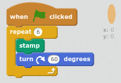

## Generate a flower

First you're going to generate a flower which can be drawn on the screen. 

+ Create a new Scratch project. 

[[[generic-scratch-new-project]]]

Now you will use the Paint tool to create a new sprite shaped like a flower petal, and name it 'Flower'. 

+ In the Paint tool, switch to **Vector** mode by clicking **Convert to Vector**, and use the Ellipse tool to draw a petal shape filled in orange (you'll use code to add more colour later). 

    

	Note: Shapes created using Vector mode look neater when you change their size. 

+ Add code to your Flower sprite to `stamp`{:class="blockpen"} a flower with six equally rotated petals when you click the green flag. 

[[[generic-scratch-stamping-sprites]]]

[[[generic-scratch-clear-stage]]]

--- hints ---
--- hint ---
You'll need to repeat the code to __stamp__ and __turn__ the petal six times. 
There are 360 degrees in a circle. Divide 360 by 6 to work out by how many degrees each petal needs to be rotated. 

You can click `clear`{:class="blockpen"} to clear the stage. 
--- /hint ---
--- hint ---
Try using these blocks:

--- /hint ---
--- hint ---
Here's the code:

You turn 60 degrees after each stamp which is 360 divided by 6.
--- /hint ---
--- /hints ---

You may find that your petals are offset in an odd way:

This is because the sprite is being rotated around its centre. 

+ Change where the centre of your petal shape is using the crosshair tool:

	

	The centre should be at the bottom centre of the petal. 

+ Clear the stage and run your code again to check that the petals are straight.

	
	

