## Customisable flowers

At the moment all the flowers are exactly the same. Let's add some inputs to the 'make flower' block so that flowers can be different colours and sizes and have different numbers of petals. 

+ In Scratch you can use the 'set colour effect' block to change the colour of a sprite. Change your 'draw flower' definition to change the colour: 

	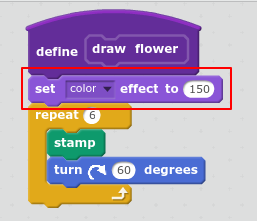	
   
+ Run your code to see different coloured flowers: 

		

	'set colour effect' changes the colour based on the default colour of the sprite so if you didn't use orange you'll get different results. 
	
+ Experiment with different numbers from 0 to 200. 
	
+ At the moment all flowers will be the same colour. We can add in 'input' to 'draw flower' to choose a different colour each time we use the block. 

	Right-click on the 'draw flower' definition block and choose 'edit':
	
	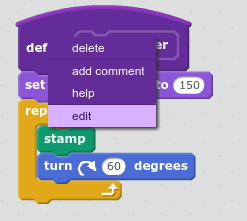	
	
+ Now add a 'number input' called colour: 

	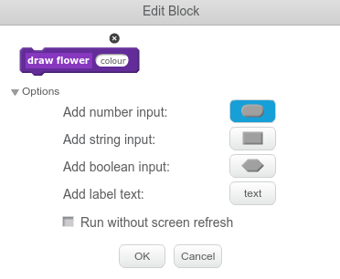	
	
+ The input will appear in the 'draw flower' definition and you can drag it to where you want to use it.

	Drag the 'colour' input to the 'set colour effect' block: 
	
	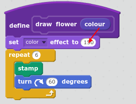
	
+ Your code should look like this:

	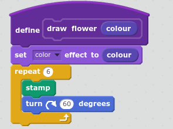
	
+ Notice that your 'draw flower' blocks now have a new input: 

	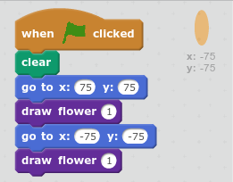
	
+ Change the numbers so that the flowers are different colours. Choose numbers between 0 and 200. 

	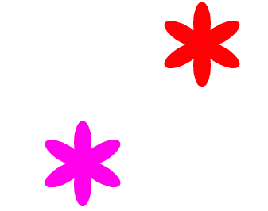
	
+ Now can you add another input to set the size of the flower so that you can write code like this:

	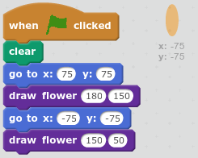

	to create flowers of different sizes:

	
	
--- hints ---
--- hint ---
Look at what you did to add the 'colour' input and repeat it to add a 'size' input which you can use to set the size of the sprite. 
--- /hint ---
--- hint ---
You'll need to use the following block with the 'size' input in your 'draw flower' definition. 

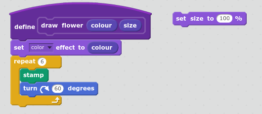

--- /hint ---
--- hint ---
Your code should look like this:

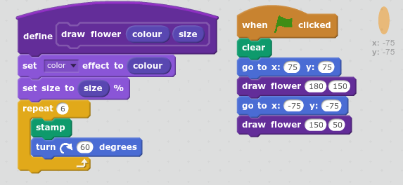

--- /hint ---
--- /hints ---

+ How about changing the number of petals? Add another input so that you can choose the number of petals each flower has so that you can draw flowers like this:

	

--- hints ---
--- hint ---
You'll need to add a 'petals' number input and then use it in the definition of the 'draw flowers' block. 

There are two places where you'll need to use the 'petals' input. The number of degrees you need to turn is 360 divided by the number of petals. 
--- /hint ---
--- hint ---
You'll need to use the following block to work out how many degrees to turn:

--- /hint ---
--- hint ---
Your code should look like this:

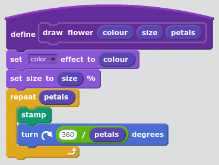

--- /hint ---
--- /hints ---

--- challenge ---

Try out your 'draw flowers' block and create some amazing patterns. Try drawing smaller flowers on top of larger ones to create interesting effects. 

--- /challenge ---

	

 