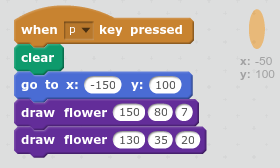
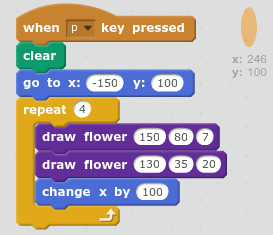
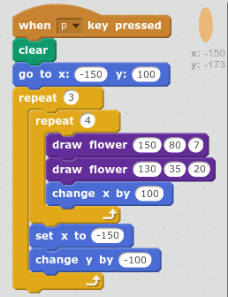
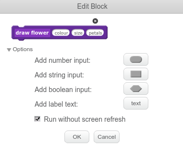
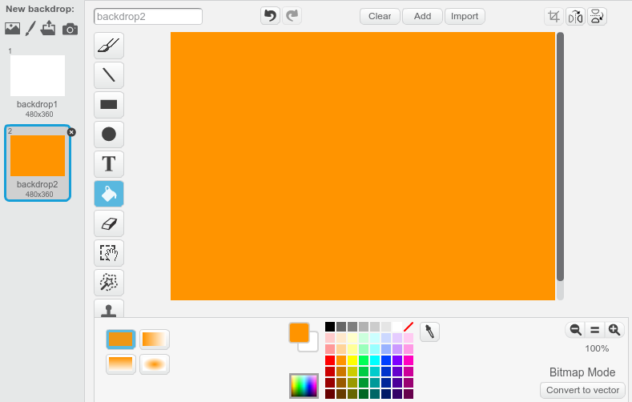

## Flower patterns

You can also use your `draw flower` block to create neat flower patterns. 

+ Create a flower or combination of flowers that you like. Here's an example:

		
	
+ Press 'p' to see your flower. The example looks like this:

		
	
+ You can right-click on the Flower sprite and `hide` it so it doesn't appear on the stage. (You can show the sprite again if you need to see where it is.)

+ Now draw a row of those flowers across the top of the stage. Here's an example, but you might need to adjust the numbers to work with your flower:

	
	
+ Press 'p' to see a row of flowers: 

	
	
+ Add another loop to create more rows of flowers. This example adds a `repeat 3` loop to create three rows. 

	
	
+ Press 'p' to see a grid of flowers: 

	
	
+ Do you want to speed up the drawing of the flowers? Right-click on the `draw flower` definition block and choose 'edit'. Tick the 'Run without screen refresh' box. 

	
	
	Now the flowers will be drawn more quickly. 

+ You can also change the colour of the stage. First create an orange backdrop by using the fill tool in Bitmap mode. 

	
	
	Using orange means that the numbers for different colours will match the ones for the petal. 
	
+ Now you can use the `set colour effect` on the __Stage__ to change the colour of the backdrop.
	
	
	
+ Try different things to create a pattern you like. 

	Here's an example: 
	
	

